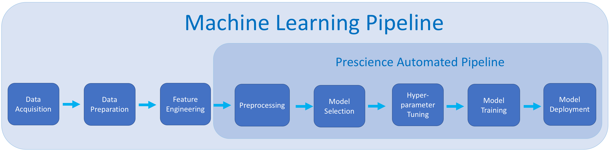
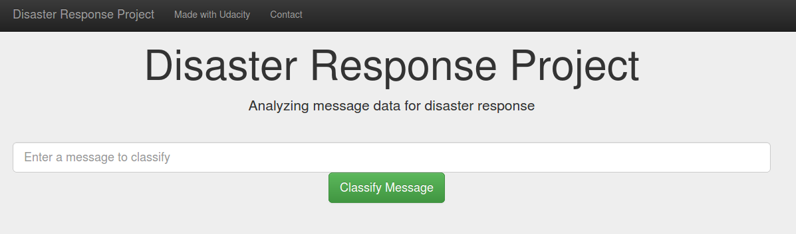

# ETL-ML-Pipelines
This repo contains the submission of DSND Data Engineering project (Tested on Ubuntu 16.04 LTS and Python 3.x)

## Getting Started
This project is a deployment for the ETL (**E**xtract - **T**ransform - **L**oad) pipeline that looks like:


**followed by** a **M**achine **L**earning pipeline, that looks like:



**deployed on** a **webapp** using *Flask*, *Bootstrap*, and *Plotly*.

## Prerequisites
In order to run this project locally on your machine, you should've the following

- [pip](https://bit.ly/2x4hZQu)
- [numpy](https://scipy.org/install.html)
- [pandas](https://pandas.pydata.org/docs/getting_started/index.html#getting-started)
- [nltk](https://www.nltk.org/install.html)
- [SQLAlchemy](https://docs.sqlalchemy.org/en/13/intro.html#installation)
- [scikit-learn](https://scikit-learn.org/stable/install.html)

## Installation
Let's start first with installing the required libraries:

<code>python -m pip install --user numpy pandas nltk SQLAlchemy scikit-learn</code>

For more installation options for Windows/Mac check the hyperlinks provided in the **previous** section.

### Running the installation tests

If all the libraries are installed correctly open terminal (ctrl + alt + t) or any Python editor of your choice, in case you used terminal type <code>python3</code>

then type in the following  code, it should get executed with no errors:
```python
import numpy
import pandas
import nltk
import sqlalchemy
import sklearn
```
Now the code is ready to run the code on your **local** machine.

## Deployment
This code is tested on dataset provided by [Figure Eight](https://www.figure-eight.com/). In order to deploy this code on your own dataset, your data should follow the format of the given datasets.

### How the code works
This code works as follows:

#### First:
The script file *'process_data.py'* takes the file paths of the two datasets and database, **cleans** the datasets, and **stores** the clean data into a **SQLite database** in the specified database file path.

#### Second:
The script file *'train_classifier.py'* takes the database file path and model file path, **creates** and **trains** a classifier, and **stores** the classifier into a **pickle file** to the specified model file path.

#### Third:
The script file *'run.py'* runs where the user can input a message into the app, the app returns classification results for all 36 categories.

### How to use (on local machine)
1. Run the following commands in the project's root directory to set up your database and model.
  - To run ETL pipeline that cleans data and stores in database

<code>python data/process_data.py data/disaster_messages.csv data/disaster_categories.csv data/DisasterResponse.db</code>

  - To run ML pipeline that trains classifier and saves

<code>python models/train_classifier.py data/DisasterResponse.db models/classifier.pkl</code>

2. Run the following command in the app's directory to run the web app.
<code>python run.py</code>

3. Go to <code>localhost:3001</code>

## The webapp
the webapp can be used to test the performance of your model **live** by typing out a custom message and see how will your model clarfiy its category(categories).



Also you can find out the categories of the messages used in the dataset.


## Evaluation
The model is evaluated using **confusion matrix**, here's a simple illustration, for more info click [here](https://towardsdatascience.com/understanding-confusion-matrix-a9ad42dcfd62)


## Acknowledgments
- [Udacity Data Science Nanodegree Program](https://www.udacity.com/course/data-scientist-nanodegree--nd025)
- [Figure Eight Datasets](https://www.figure-eight.com/)
- [Understanding Confusion Matrix](https://towardsdatascience.com/understanding-confusion-matrix-a9ad42dcfd62)
